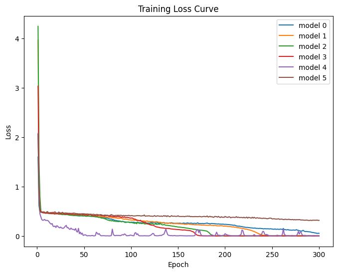
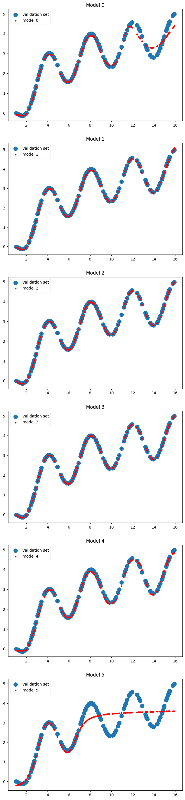
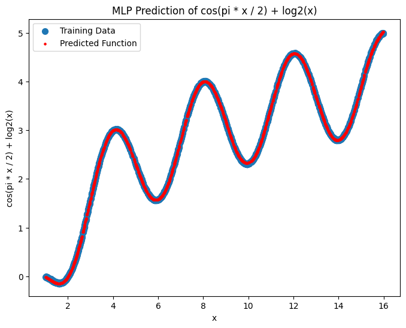

# 1. 实验要求
使用pytorch 或者tensorflow 手写一个前馈神经网络，用于近似以下函数： $y=\log_{2}(x)+\cos\left( \frac{\pi x}{2} \right), x \in$[1, 16]， 研究数据量、网络深度、学习率、网络宽度、激活函数对模型性能的影响。
# 2. 关键代码
## 2.1. 数据准备
用random库的uniform函数生成均匀分布的随机变量，然后用sample函数采样2000个数据。标签 $y$ 用torch内的数学函数计算。
```python
unique_random_numbers = random.sample([random.uniform(1, 16) for _ in range(num_data * 2)], num_data)
x = torch.tensor(unique_random_numbers).unsqueeze(1)
y = torch.cos(torch.pi * x / 2) + torch.log2(x)
```
随后将 $x,y$ 按 $8:1:1$ 划分为训练集、验证集、测试集。

## 2.2. 模型定义
定义MLP类，传入参数包括输入维度、输出维度、隐藏层数量、每个隐藏层的单元数。
```python
class MLP(nn.Module):
    def __init__(self, input_size, output_size, hidden_layers, hidden_units=[32])
```
下面的代码定义了隐藏层列表 `self.hidden` ，未指定单元数的隐藏层用最后一层维度填充（若所有隐藏层都没有指定，默认都是32维）。
```python
        # 创建隐藏层
        self.hidden = nn.ModuleList()
        for i in range(hidden_layers):
            try:
                self.hidden.append(nn.Linear(input_size, hidden_units[i]))
                input_size = hidden_units[i]
            except:
                self.hidden.append(nn.Linear(input_size, hidden_units[-1]))
                input_size = hidden_units[-1]
            self.hidden.append(nn.Tanh())
```

随后创建模型列表，包含了多个不同深度、不同宽度的MLP：
```python
# 初始化模型
model = [MLP(1, 1, 2, hidden_units=[64]), 
         MLP(1, 1, 3, hidden_units=[32]), 
         MLP(1, 1, 4, hidden_units=[32]),
         MLP(1, 1, 4, hidden_units=[16, 32, 64, 32]),
         MLP(1, 1, 4, hidden_units=[32]), 
         MLP(1, 1, 4, hidden_units=[32])]
```

## 2.3. 损失函数、优化函数和数据加载器
损失函数用均方误差函数 `torch.nn.MSELoss` 。

优化算法采用 $lr=0.001$ 的Adam算法，同时设置了学习率 $lr=0.01$ 的Adam算法和SGD算法做对照。

数据加载器用pytorch中的 `torch.utils.data.DataLoader`，batch_size设置为32。

# 3. 训练结果
## 3.1. 训练集比较
训练300个epoch，画出不同模型的损失曲线：


分析不同模型的效果:
1. 蓝色为 $2*64$（2层隐藏层，每层64个单元）的MLP，可以看到在参数总量相同的情况下，浅层网络收敛速度实际上更慢，在300个epoch后还未收敛。
2. 橙色为 $3*32$ 的MLP，收敛速度比其他4层网络更慢。
3. 绿色为 $4*32$ 的MLP，收敛速度比3层和2层的网络都快。
4. 红色为4层、每层维度依次为 $[16,32,64,32]$ 的MLP，可以看到在学习率与总参数量相同的情况下，宽度递增的MLP收敛速度最快。
5. 紫色为 $4*32$ 、学习率为 $0.01$ 、Adam算法优化的MLP，虽然收敛速度显著变快，但是在最小值附近出现明显的震荡。
6. 棕色为 $4*32$ 、学习率为 $0.01$ 、SGD算法优化的MLP，可以看到随机梯度下降的速度比Adam慢很多。更大的学习率并没有弥补SGD和Adam的速度差距，并且如果训练更长时间，SGD也会在最小值附近震荡，在训练阶段SGD并没有优势。
> 据说SGD的泛化能力会更强。训练数据实际上加了一个标准差为 0.01 的小噪声，但是尝试训练5000个epoch到SGD收敛，也并没有观察到验证集上SGD反杀。

## 3.2. 验证集比较
比较各个模型在验证集上的损失函数值：
```
Model 0, Validation Loss: 0.0421
Model 1, Validation Loss: 0.0017
Model 2, Validation Loss: 0.0004
Model 3, Validation Loss: 0.0002
Model 4, Validation Loss: 0.0055
Model 5, Validation Loss: 0.3133
```

Model 0和Model 5由于没有收敛，损失函数最大。Model 4由于震荡，也不如Model 2和Model 3表现好。Model 1是三层的MLP，没有其他四层MLP效果好。

Model 2 和 Model 3都是4层的MLP，Model 3采用变化的宽度后收敛速度加快，最终效果接近，可见调整宽度在此次实验是一种有用的技巧。

画出不同模型在验证集上的预测值，并与原始数据比较：


可以看到Model 0 和Model 5由于还未收敛效果最差，Model 4由于震荡有一些偏差，其他模型效果都很好。

## 3.3. 测试集
选取效果最好的模型（这里是Model 3），计算测试集上的损失函数：
```
Best Model, Test Loss: 0.0002
```
效果和验证集接近（仔细检查过了，val和test没有重叠部分）。

画出最终对所有输入的预测结果，和原始数据接近：


# 4. 总结
本次实验有以下感悟：
1. SGD算法收敛速度慢于Adam算法
2. 参数总数相同时，深度更深的模型往往效果更好
3. 调整每层的宽度，可能有助于提高模型性能
4. 在最小值附近震荡对模型的性能影响比较大，采用合适的学习率，或者用学习率衰减的策略很有必要
