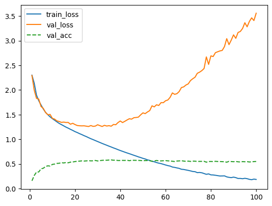
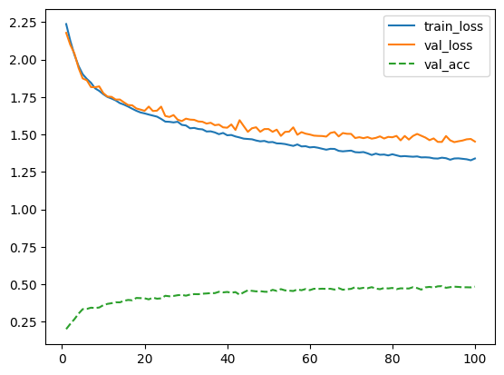
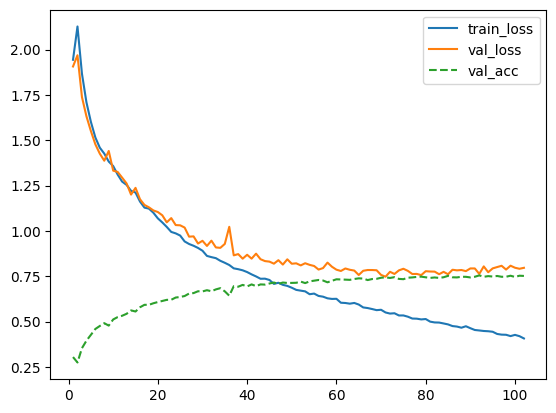
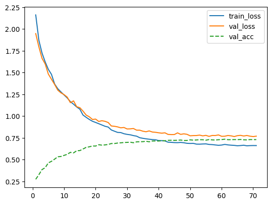
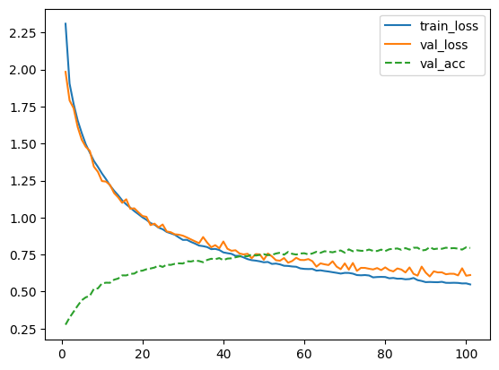
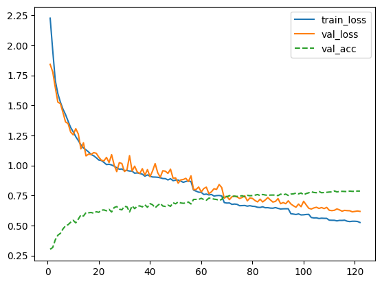
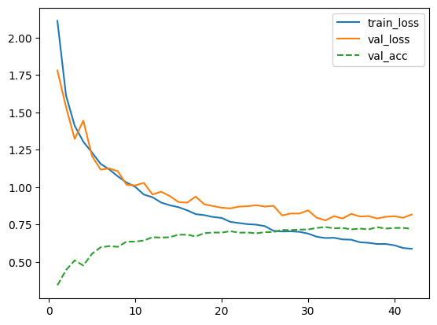
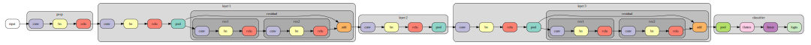
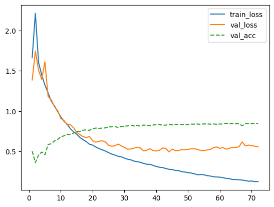
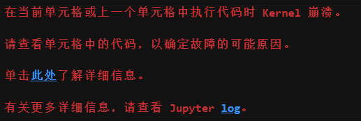

# 1. 实验要求
使用pytorch 或者 tensorflow 实现卷积神经网络CNN，在CIFAR-10数据集 上进行图片分类。研究dropout、normalization、learning rate decay 等模型训练技 巧，以及卷积核大小、网络深度等超参数对分类性能的影响。

# 2. 数据集处理
加载数据集后，将训练数据9：1划分为训练集和验证集（为了比较不同模型的效果，固定了随机数种子为3407，确保每次划分一致）：
```python
train_data, val_data = torch.utils.data.random_split(train_data, [train_size, val_size])
```
最终数据集大小如下：
```
训练集大小: 45000
验证集大小: 5000
测试集大小: 10000
```
随后对划分出的训练集做数据增强，包括水平翻转、填充后剪切，以及归一化：
```python
# 训练集数据增强
augmentation = transforms.Compose([
                                   transforms.RandomHorizontalFlip(),
                                   transforms.RandomCrop(32, padding=4),
                                   Trans
                                   ])
```
> 归一化数据为 `Normalize((0.4914, 0.4822, 0.4465), (0.2023, 0.1994, 0.2010)`，但据 [这个Issue](https://github.com/gpleiss/efficient_densenet_pytorch/issues/68) 说，其实这是CIFAR-100的期望和标准差。发现此事的时候实验已经基本做完了，因此没有改，换成CIFAR-10的可能会更好。

# 3. 实验过程
## 3.1. 线性分类器
使用简单的两层MLP，将图像flattern为一维向量后分类，效果很差，基本是随机预测：
```
Epoch 10 
------------------------------- 
Train loss: 2.31486 | Train accuracy: 9.95% 
Validation loss: 2.31687 | Validation accuracy: 10.23%
```
在fashionMNIST数据集上，线性分类器可以达到80%的准确率（[可以看这个链接](https://www.learnpytorch.io/03_pytorch_computer_vision/#1-getting-a-dataset)），CIFAR则基本是线性不可分的。不利用空间信息的话，很难做到比较好的准确率。
## 3.2. LeNet
从简单的CNN开始，使用LeNet分类，在没有数据增强时，最终结果和loss趋势图如下：


```
Epoch 100
-------------------------------
Train loss: 0.18473 | Train accuracy: 93.32%
Validation loss: 3.55717 | Validation accuracy: 54.94%
```

可以看到在不加任何泛化措施的情况下，过拟合比较严重。

## 3.3. 加入BN的LeNet
应用数据增强后，将LeNet的每一个卷积层都改为 BN-ReLU-Conv 的卷积块，并添加一个卷积块和池化层，结果如下：


```
Epoch 100
-------------------------------
Train loss: 1.33992 | Train accuracy: 52.22%
Validation loss: 1.45287 | Validation accuracy: 48.43%
```

可以看到虽然过拟合得到了控制，但简单的CNN已经无法对数据增强后的数据有效分类，即使训练集的准确率也很低。因此考虑更复杂的网络ResNet。

## 3.4. ResNet上的控制变量研究
LeNet到ResNet之间还有几个常见网络，比如AlexNet、VGG、GoogLeNet，但是ResNet参数量少，实现也不困难，因此直接跳到ResNet，研究dropout和正则化的影响。
### 3.4.1. 一些训练细节
网络结构参考 [ResNet 详解](https://zhuanlan.zhihu.com/p/550360817) 这篇文章，实现ResNet18，并有如下修改：
#### 3.4.1.1. 网络
1. 由于CIFAR-10的分辨率比ImageNet低，因此第一个prep层的卷积核大小和步长减少，删除池化层：
    ```python
   def b1(self):
        return nn.Sequential(
            nn.LazyConv2d(64, kernel_size=3, stride=2, padding=3),
            nn.LazyBatchNorm2d(), nn.ReLU(),
            #nn.MaxPool2d(kernel_size=3, stride=2, padding=1)
            )
    ```

2. 每个残差块由两个 $3 \times 3$ 卷积组成，在两个卷积之间加入一个Dropout层。

修改后网络概览如下：
```
Sequential output shape:	 torch.Size([1, 64, 18, 18])
Sequential output shape:	 torch.Size([1, 64, 18, 18])
Sequential output shape:	 torch.Size([1, 128, 9, 9])
Sequential output shape:	 torch.Size([1, 256, 5, 5])
Sequential output shape:	 torch.Size([1, 512, 3, 3])
Sequential output shape:	 torch.Size([1, 10])
```
第一个Sequential为prep层，后续每一层都有两个残差块。右边为数据通过这一层后的维度变化。

#### 3.4.1.2. 训练
1. 优化算法统一采用Adam算法，学习率为0.01
2. 学习率根据train_loss自适应改变，patience为5，触发后学习率减半
3. EarlyStopper根据验证集测试率触发，patience为10

### 3.4.2. 只有数据增强时的结果
只使用数据增强时，结果如下：


```
Epoch 102
-------------------------------
Train loss: 0.40690 | Train accuracy: 85.22%
 50%|█████     | 101/200 [13:18<13:03,  7.91s/it]
Validation loss: 0.79639 | Validation accuracy: 75.16%
```
可以看到由于过拟合，验证集loss不再下降，导致EarlyStop触发。

### 3.4.3. 使用dropout
使用resnet18，将残差块中dropout层参数设置为0.5，结果如下：


```
Epoch 71
-------------------------------
Train loss: 0.66169 | Train accuracy: 76.34%
 35%|███▌      | 70/200 [14:47<27:27, 12.68s/it]
Validation loss: 0.76953 | Validation accuracy: 73.01%
```

过拟合得到很好的控制，但是网络似乎被过度削弱了（后来意识到这是因为学习率调度不好）。

换用resnet34，在同样条件下训练：


```
Epoch 101
-------------------------------
Train loss: 0.54843 | Train accuracy: 81.32%
 50%|█████     | 100/200 [34:18<34:18, 20.59s/it]
Validation loss: 0.61166 | Validation accuracy: 79.45%
```
在同样条件下更深的ResNet准确率更高，过拟合也没有变强。

### 3.4.4. 使用正则化
weight_decay设置为1e-4，使用resnet34训练，结果如下：


```
Epoch 122
-------------------------------
Train loss: 0.52547 | Train accuracy: 81.56%
 60%|██████    | 121/200 [38:34<25:11, 19.13s/it]
Validation loss: 0.61779 | Validation accuracy: 78.69%
```

可以看到正则化也能很好的控制过拟合，并且这次训练还很明显的看出了学习率衰减的效果。

如果减弱数据增强（只使用水平翻转），其他条件不变，依靠正则化来控制过拟合，结果如下：


```
Epoch 42
-------------------------------
Train loss: 0.58724 | Train accuracy: 79.39%
 20%|██        | 41/200 [10:50<42:03, 15.87s/it]
Validation loss: 0.81660 | Validation accuracy: 72.02%
```

由于过拟合，在第42个epoch就停止了。说明数据增强在抑制过拟合上也很有用。

## 3.5. 效果最好的ResNet9

 [DAWNBench](https://dawn.cs.stanford.edu/benchmark/#cifar10) 榜单上对ImageNet主要使用ResNet50，而CIFAR-10主要使用ResNet9，说明9层的简单网络已经足够应对CIFAR-10。而我自己用ResNet18/34得到的效果不佳，推测主要是学习率策略不好。因此参考 [JonathanRayner/ResNet9](https://github.com/JonathanRayner/ResNet9/tree/master) 这个仓库实现了ResNet9，网络结构如图:


使用和之前相同的优化器参数、学习率策略，最终验证集准确率也是79%左右。而采用上面仓库中选择的训练策略（ `SGD(lr=0.001, weight_decay=1e-4, momentum=0.9, nesterov=True)` ），准确率则达到84%:


```
Epoch 72
-------------------------------
Train loss: 0.12587 | Train accuracy: 95.48%
 36%|███▌      | 71/200 [19:24<35:16, 16.40s/it]
Validation loss: 0.55651 | Validation accuracy: 84.76%
```

这也是本次实验达到的最好结果。

## 3.6. 并没有跑出来的DenseNet
实现了DenseNet，尝试将数据resize为 $224 \times 224$ 后采用DenseNet169训练，但由于参数大、训练慢，用自己电脑跑的时候死机了，租了个便宜显卡跑也没跑出来，似乎显存溢出崩溃了：


因此没有保存，也没有最后的趋势图，只有训练时每个epoch的输出：
```
Epoch 37
-------------------------------
Train loss: 0.44578 | Train accuracy: 84.39%
 18%|█▊        | 37/200 [1:51:47<8:18:05, 183.35s/it]
Validation loss: 0.58281 | Validation accuracy: 80.43%
```
> 这次结果在更早保存的一个版本里（lab2_densenet），本次实验的其他结果都在lab2.ipynb里。

可以看到崩溃前DenseNet准确率很高，训练完成的话应该会比resnet更好。而且虽然没有使用正则化和dropout，过拟合仍然不严重。
但相应的，训练时每个epoch的耗时大约是ResNet18的3到6倍，而这之中数据加载还不是主要原因。对显存和内存的要求也高了不少。因此对简单的数据集，选择太复杂的网络并不必要。

# 4. 评估
本次实验保存了的模型里最好的是ResNet9，加载后在test_set上评估，loss和准确率如下：
```
(tensor(0.5600, device='cuda:0'), 85.28492647058823)
```
准确率为85.28%，比验证集略好一点。

# 5. 总结
本次实验的感悟如下：
1. 数据增强、dropout、正则化都能有效控制过拟合。
2. 选择合适的学习率调度策略、优化器参数、早停策略对训练出好结果很重要。
3. 更深的网络往往有更好的效果，但视具体任务而言，不一定有必要。
5. vscode使用jupyter如果崩溃或者中断，占用的显存不会释放，需要重启内核或者手动杀进程。另外，jupyter内核运行太久了就会有很多怪bug，感觉要经常重启内核。

