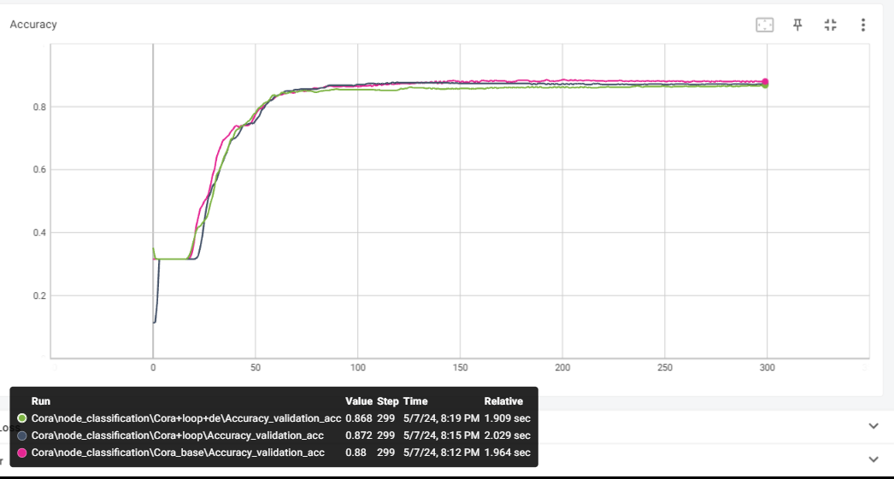
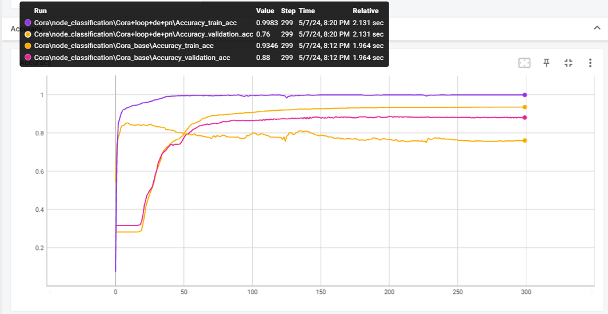
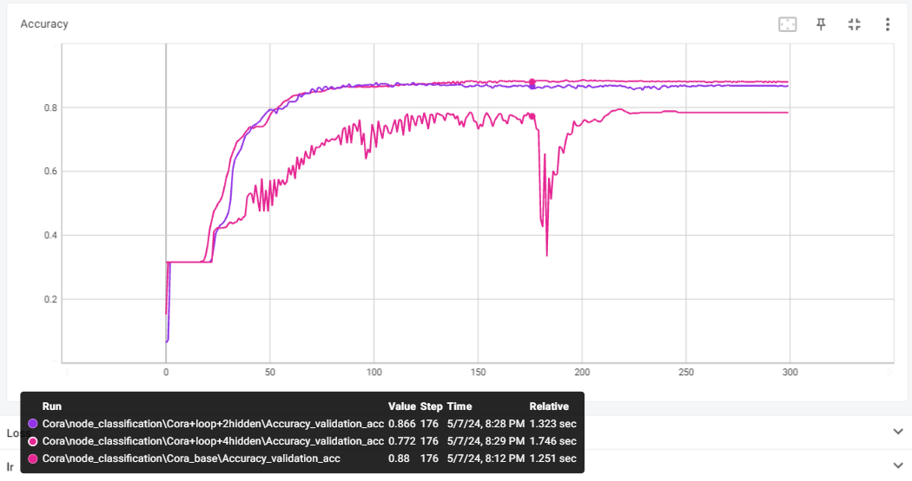
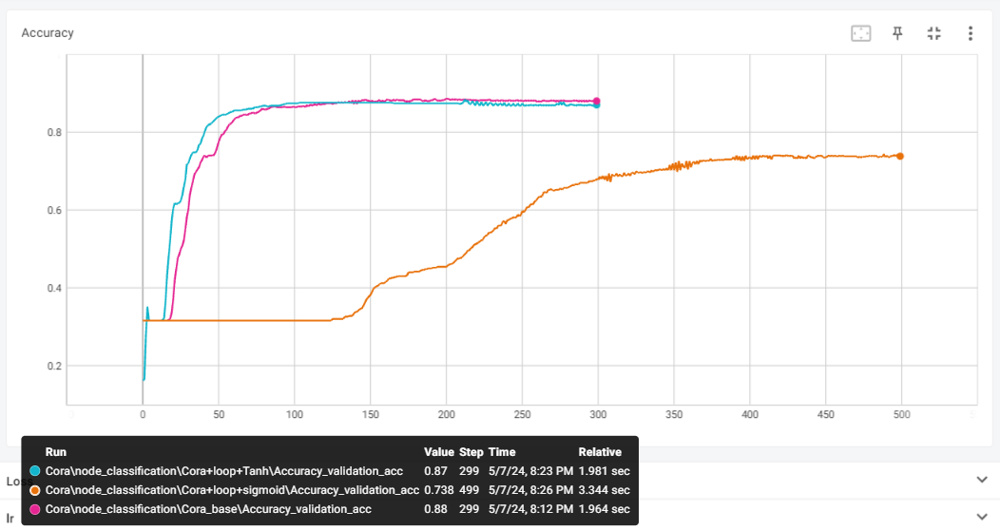
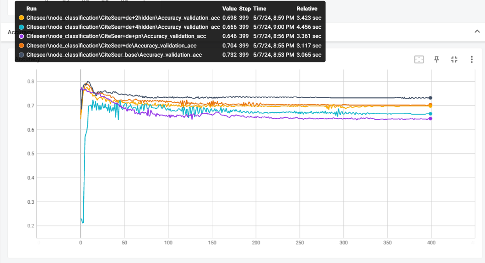
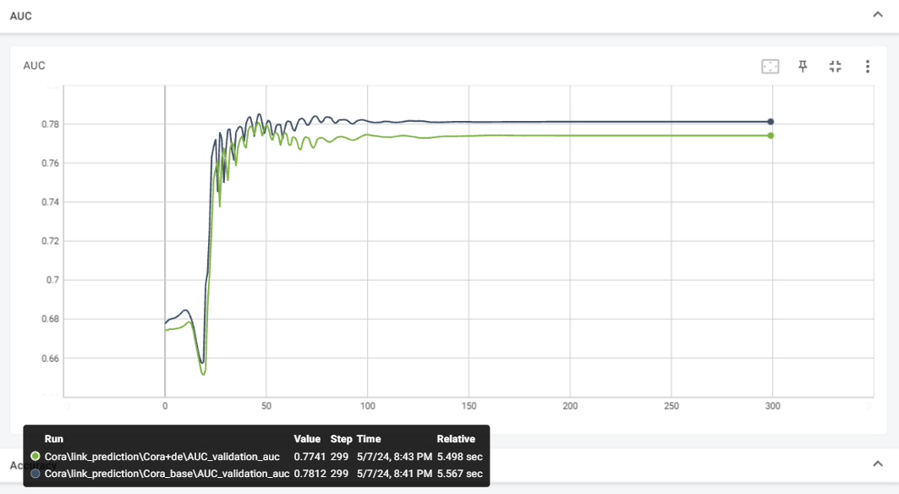
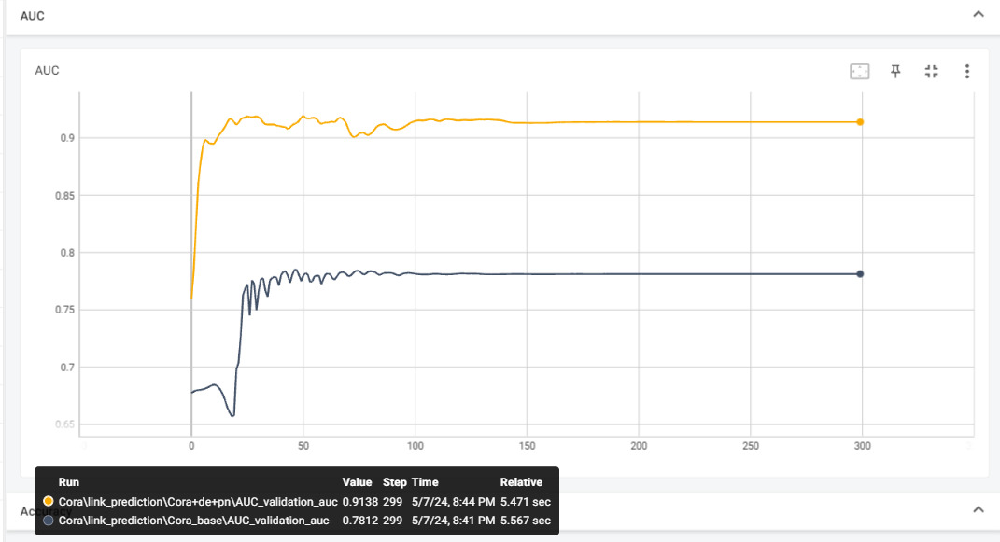
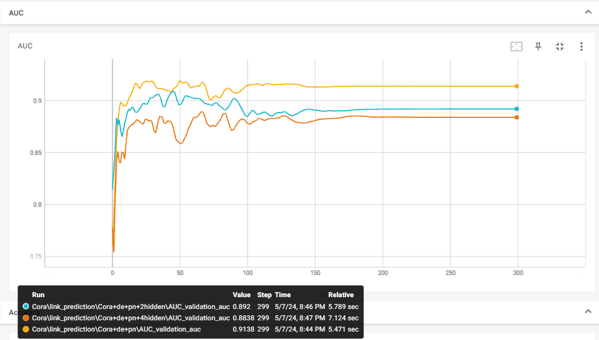
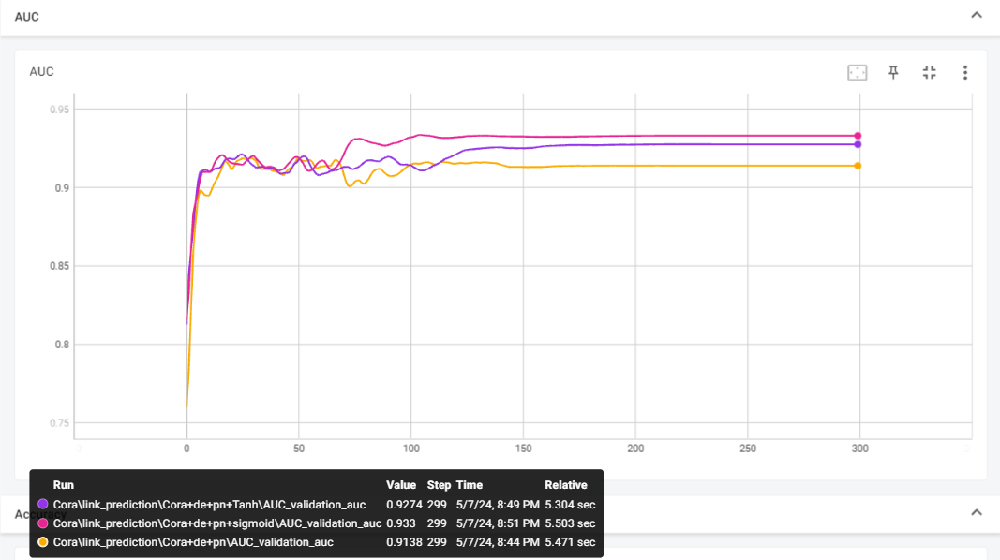
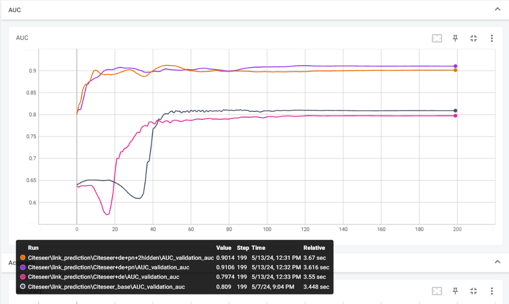

# 数据集概览
用PyG库提供的Planetoid方法加载数据集，Cora数据集概览如下：
```
Dataset: Cora():
======================
Number of graphs: 1
Number of features: 1433
Number of classes: 7

Data(x=[2708, 1433], edge_index=[2, 10556], y=[2708], train_mask=[2708], val_mask=[2708], test_mask=[2708])
Number of nodes: 2708
Number of edges: 10556
Average node degree: 3.90
Number of training nodes: 1208
Number of validation nodes: 500
Number of test nodes: 1000
Training node label rate: 0.45
Contains isolated nodes: False
Contains self-loops: False
Is undirected: True
```

可以看到：
1. Cora包含一张无向图
2. 一共2708个结点，每个节点有一个1433维的表征，保存在x中。节点分为七类，标签在y中。
3. 有10556条边，edge_index保存了每条边的起点和终点。
4. 结点划分train:val:test=1208:500:1000。Cora默认训练集只有120个节点，尝试训练后效果不好，因此重新划分，将不在val和test中的结点都加入train，最终train有45%的节点。
5. 默认是不含自环的。

CiteSeer数据集类似：
```
Dataset: CiteSeer():
======================
Number of graphs: 1
Number of features: 3703
Number of classes: 6

Data(x=[3327, 3703], edge_index=[2, 9104], y=[3327], train_mask=[3327], val_mask=[3327], test_mask=[3327])
Number of nodes: 3327
Number of edges: 9104
Average node degree: 2.74
Number of training nodes: 1827
Number of validation nodes: 500
Number of test nodes: 1000
Training node label rate: 0.55
Contains isolated nodes: True
Contains self-loops: False
Is undirected: True
```

做链路预测时，需要用PyG库的RandomLinkSplit方法划分数据集中的边，train:val:test=8:1:1。划分后val和test都带有负边，train需要在每次训练时用PyG中的negative_sampling做负采样。

# 模型
首先根据下面的公式，实现图卷积层：
$\mathbf{H}^{(l+1)} = \sigma\left( \tilde{\mathbf{D}}^{-\frac{1}{2}} \hat{\mathbf{A}} \tilde{\mathbf{D}}^{-\frac{1}{2}} \mathbf{H}^{(l)} W^{(l)} \right)$
其中 $\tilde{D}$ 为度矩阵，$\hat{A}$ 加自环时为 $A+I$，A为邻接矩阵。

随后堆叠GCNConv构建GNN。在GCNConv前使用Dropedge，在每个GCNConv之后用Pairnorm：
```Python
if self.drop_edge and self.training:

edge_index = dropout_edge(edge_index, p=0.5)
for conv in self.net:
     x = self.activation(conv(x, edge_index))
     if self.pair_norm:
         x = self.norm_layer(x)
x = self.last_conv(x, edge_index)
```

在节点分类任务中，图卷积层的结果经过softmax，输出分类概率。在链路预测任务中，图卷积层的结果作为encode层结果，decode部分进行element-wise矩阵乘法，结果用sigmoid处理为二分类概率，用节点表征预测两节点之间是否有边。

```python
    def decode(self, z, edge_label_index):

        # z所有节点的表示向量

        src = z[edge_label_index[0]]

        dst = z[edge_label_index[1]]

        # print(dst.size())   # (7284, 64)

        r = (src * dst).sum(dim=-1)

        # print(r.size())   (7284)

        return r
```

# 调参分析
## 节点分类
损失函数为交叉熵损失，优化器为Adam(lr=0.01, weight_decay=5e-4)，

### Cora数据集
#### dropedge和自环


1. base采用两层GCN，没有自环、dropedge、pairnorm，激活函数为ReLU。最终验证集准确率为0.88。
2. 加入自环后，准确率为0.872，略有下降。
3. 加入dropedge后，准确率为0.868，略有下降。

可以看到节点分类时，dropedge和自环基本没有影响。

#### pairnorm


加入pairnorm后准确率下降到0.76，可以看到加入pairnorm后过拟合比较严重。下面的实验中不加入parinorm。

#### 层数

从两层换为3层和5层时，准确率都有所下降。对于Cora数据集，两层的GCN已经足够，更深层容易过拟合。

#### 激活函数


将激活函数从ReLU换为Tanh时，准确率变化不大。但换为sigmoid时，收敛速度大幅下降，应该落到了梯度过小的区间。其他条件下50步基本收敛，sigmoid500step后仍未收敛，准确率显著低。

#### test
最终用两层GCN、加自环、不加dropedge和pairnorm、ReLU激活函数，在测试集准确率为：
```
0.877
```

### CiteSeer


在Citeseer数据集上，上述参数似乎都没有增加准确率，最高的为base条件下0.732。

测试集上，base条件下准确率为：
```
0.729
```

## 链路预测
损失函数为BCEWithLogits，优化器为Adam(lr=0.01, weight_decay=5e-4)。
由于边划分后，训练集的边不能构成连通图，有些孤立的点会导致度矩阵成为奇异矩阵，无法用GCN处理，因此都要加入自环。
Cora和Citeseer根据词袋向量给出的表征已经有一定表达能力，auc初始值基本都在0.65以上，好于随机预测。
链路预测任务中，encode输出维数太少会导致auc显著下降，最终采用的是64维。但是没保存中间实验结果，encode输出7维时auc大约只有0.7，与初始值相比提升不大。

### Cora
#### dropedge


base采用两层GCN，没有dropedge、pairnorm，激活函数为ReLU，encode输出为64维，验证集auc为0.7812。
加入dropedge后，auc略有下降，作用不明显。

#### pairnorm



加入pairnorm后auc显著提升，达到0.9138。

#### 层数



增加层数到3层和5层，auc下降，两层GCN仍然有合适的表达能力。

#### 激活函数



更换激活函数，Tanh和sigmoidauc略有上升，此时sigmoid收敛速度和其他激活函数相似，没有落到梯度过小的区间内。

#### 测试
最终采用两层GCN、加自环和pairnorm、不加dropedge、激活函数为sigmoid的模型，在测试集上auc为：
```
0.9430560006337114
```

### CiteSeer



Citeseer上与Cora类似，dropedge和层数影响不大，加入pairnorm后auc显著上升。

最终采用两层GCN、加自环和pairnorm、不加dropedge的模型，在测试集上auc为：
```
0.922043231493781
```


