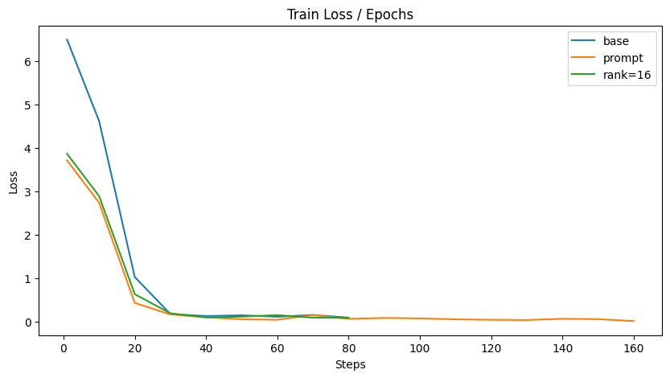

# 数据集构建
数据集为 [zh_cls_fudan-news · 数据集 (modelscope.cn)](https://www.modelscope.cn/datasets/huangjintao/zh_cls_fudan-news)，是一个小型轻量的数据集，训练集包含了大约4k条新闻报道，每篇有对应的分类选项，以及标注好的分类标签。

作为示例，其中一条正文为:
```
【 文献号 】4-2054 【原文出处】史学月刊 【原刊地名】开封 【原刊期号】199804 【原刊页号】118～120 【分 类 号】K5 【分 类 名】世界史 【复印期号】199809 【 标 题 】正确评价世界近代史上的历史人物 【 作 者 】秦元春 【作者简介】作者秦元春，1964年生，淮南师范专科学校历史系讲师。淮南，232001 【 正 文 】 历史科学是一门准确而严谨的科学。正确了解和评价各个时期的历史人物及其所从事的活动，是历史研究的一个重要组成部分。在世界历史的长河中，有许多类别不同的历史人物，由于特定的条件和环境，具有比较复杂的特性。因此，遵循马克思历史唯物主义的观点，正确评价历史人物，在历史研究与教学过程中尤为重要。一 正确评价资产阶级革命中的各种头面人物世界近代史是资本主义发生、发展的历史。资本主义社会如同封建社会一样，都是人类社会历史发展过程中的必然阶段...
```

分类选项为：
```
["Electronics","Politics","Economy","Military","Art","Law","Computer","Energy","Agriculture","Philosophy","Mine","Literature","History","Education","Communication"]
```

标签为：
```
History
```

这个数据集的大多数正文非常的长，有超过一万条token的。

swift框架支持了这个数据集，默认是采10条数据作为测试集。上面的链接中作者也给出了手动处理此数据集的方法（作者提供的测试集是没有标签的，做实验需要自行划分）。

# 模型选择
模型为零一万物的 yi-6b，swift框架支持了这个模型。swift注释中预计微调此模型需要15G显存，实验时也差不多，基本充分利用了实验使用的3090。

复旦新闻分类数据集的示例代码中用了qwen1.5_1.8b模型，微调大约要8G显存，但是使用数据集作者提供的代码推理时要超过24G显存，3090爆显存了。暂时不知道示例代码哪里有问题：

```
torch.cuda.OutOfMemoryError: CUDA out of memory. Tried to allocate 6.44 GiB. GPU 0 has a total capacity of 23.69 GiB of which 3.87 GiB is free. Process 1175851 has 19.81 GiB memory in use. Of the allocated memory 13.90 GiB is allocated by PyTorch, and 5.61 GiB is reserved by PyTorch but unallocated. If reserved but unallocated memory is large try setting PYTORCH_CUDA_ALLOC_CONF=expandable_segments:True to avoid fragmentation.  See documentation for Memory Management  (https://pytorch.org/docs/stable/notes/cuda.html#environment-variables)
```

此外，yi-6b 也有些奇妙bug。前面提到swift框架默认采10条做测试，对这个数据集似乎是采了相对短的10条。当我尝试增加样本数，设置 `--show_dataset_sample` 时，几乎每一条新的样本都会报错，且不会输出标签：

```
AssertionError: Current sentence length exceedsthe model max_length: 4096
```

无论我修改模型参数，还是设置裁剪策略为 `'truncation_left'` ，都无法避免这个问题。随后尝试了 baichuan2_7b 和 qwen1.5_1.8b ，都没有这个问题。暂时没搞懂为什么。

不过我们选择的数据集最后几个Token应该是分类选项，属于重要信息，不应该裁剪。所以退而求其次，我用框架默认的10条测试数据进行了大部分实验。

# prompt设计
[我是如何赢得GPT-4提示工程大赛冠军的 | 机器之心 (jiqizhixin.com)](https://www.jiqizhixin.com/articles/2024-05-14-4) 这篇报道提到了一种设计prompt的框架，即 CO-STAR 框架：


不过这主要是针对一些生成式的任务设计的，我们的任务只需要输出给定选项中的一个，这张图中的Style、Tone、Response等都用不到。因此最后我设计了一个很简单的prompt，他用到了图中的Context和Objective两部分，加在新闻正文的前面。

我通过在 custom.py 中新注册一个名为 myown 的template，并在训练参数中指定参数 `--template_type myown` 来应用提示词：

```Python
register_template(
    CustomTemplateType.myown,
    Template(['{{SYSTEM}}'], ['\n\n### Instruction:你是一位报社编辑。现在给出一篇新闻报道，请判断它属于给定类别中的哪一种：\n{{QUERY}}\n\n### Response:\n'], [], [['eos_token_id']]))
```

应用提示词后的一个样本输出如下：

```
--------------------------------------------------
[PROMPT]

### Instruction:你是一位报社编辑。现在给出一篇新闻报道，请判断它属于给定类别中的哪一种：
输入: 航空动力学报JOURNAL OF AEROSPACE POWER1999年　....（正文不展示了）　
分类: Economy，Energy，Electronics，Space
输出: 

### Response:
[OUTPUT]Economy
<|endoftext|>

[LABELS]Space
```

实际上模型输出应该只有Economy，其他部分都是swift框架拼接起来的。

# 微调方法
微调采用LORA方法，示意图如下，来自博客 ([LoRA的原理简介_lora机制-CSDN博客](https://blog.csdn.net/stingfire/article/details/138315770))：


公式为：
$$h = (W_0 +\Delta W)x = (W_0 +B A )x$$
其中 h 表示经过LoRA处理后的输出向量，$W_{0}$​ 是基础模型的权重矩阵，Δ$W$表示由LoRA模块产生的权重更新量。LoRA假设 Δ$W$ 可以进行低秩分解，从 $d \times d$ 维矩阵分解为两个 $d \times r$ 维矩阵相乘，$r \ll d$，从而大幅减少参数量。

LoRA方法还有另一个超参数 $\alpha$，控制 $\Delta W$ 的更新步长。

在swift框架中，$r$ 和 $\alpha$ 可以用参数 `--lora_rank` 与 `--lora_alpha` 指定。

# 效果比对
## 不同参数



base表示rank=8、不加提示词的情况。橙色线rank为8，绿色线带有prompt。

可以看到训练足够久的话loss差别不大，取第80个steps，结果如下：

| setting | train loss | eval acc |
| ------- | ---------- | -------- |
| base    | 0.0998     | 0.9743   |
| prompt  | 0.0714     | 0.9743   |
| rank=16 | 0.0941     | 0.9801   |
加入prompt后loss略有下降，但准确率变化不大。增加rank则能增加准确率，不过又增大了参数量，减慢训练速度。

## 不同步数


由于每40步进行一次评估，所以评估准确率其实变化不大（第40步已经效果很好了）。

## 与原模型对比
我写了一段代码，读取测试数据，用原模型预测，并查看它是否与label一致：

```
import json

  

# Experimental environment: 3090

import os

os.environ['CUDA_VISIBLE_DEVICES'] = '0'

  

from swift.llm import (

    get_model_tokenizer, get_template, inference, ModelType,

    get_default_template_type, inference_stream

)

from swift.utils import seed_everything

import torch

  

model_type = ModelType.yi_6b

template_type = get_default_template_type(model_type)

print(f'template_type: {template_type}')  # template_type: qwen

  
  

kwargs = {}

# kwargs['use_flash_attn'] = True  # 使用flash_attn

  

model, tokenizer = get_model_tokenizer(model_type, torch.float16,

                                       model_kwargs={'device_map': 'auto'}, **kwargs)

# 修改max_new_tokens

model.generation_config.max_new_tokens = 128

  

template = get_template(template_type, tokenizer)

seed_everything(42)

with open('./output/yi-6b/v3-20240630-224222/checkpoint-80/infer_result/20240630-231712.jsonl', 'r') as file:

    correct_lines = 0

    total_lines = 0

    for line in file:

        data = json.loads(line)

        query = data['query']

        print(query)

        response, history = inference(model, template, query)

        total_lines += 1

        print(data['label'])

        print(response)

        if data['label'].strip() == response.strip():

            correct_lines += 1

  

# 计算准确率

accuracy = correct_lines / total_lines if total_lines > 0 else 0

  

# 输出结果

print(f"Total lines: {total_lines}")

print(f"Correct lines: {correct_lines}")

print(f"Accuracy: {accuracy * 100:.2f}%")
```

最终微调过的模型可以达到90%正确率，而原模型是0%，输出完全牛头不对马嘴。其中一例如下：

```
输入: 环境科学学报ACTA　SCIENTIAE　CIRCUMSTANTIAE1998年2月第18卷第2期科技期刊微量元素镍在小白鼠脏器内积累规律的研究汪燕芳(江西师范大学化学系，南昌330027)周松茂　张奇凤　陈国树(南昌大学化学系)范广勤　阎　冀　刘延芳(江西医学院卫生系)关键词　　镍；脏器；积累规律.ACCUMULATIVE REGULARITY OF NICKEL IN THE VISCERA OF SMALL WHITE MICEWang Yanfang, Zhou Songmai, Zhang Qifeng, Chen Guoshu(Department of Chemistry, Nanchang University, Nanchang 330047)Fan Guangqin, Yan Ji, Liu Yanfang(Department of Health, Jiangxi Medical College, Nanchang 330006)ABSTRACT　Adult small white mice are used for the experiment. This paper studies the distribution of nickel accumulation in the viscera of mice under different conditions and the influence of copper, iron and selenium to the accumulation of nickel. The results show that the accumulation of various species of nic-kel in the viscera of small white mice is different, the accumulation of inorganic nickel is apparently higher than that of organic nickel. Copper and iron have synergistic effect to the accumulation while selenium has antagonistic effect.Keywords　viscera, accumulative regularity, nickel.微量元素镍广泛地分布在大气、水体、土壤和生物体内环境中.研究表明，人体摄入过量的微量元素镍能引起中毒症［1―3］，影响DNA的合成和RNA的复制，引起细胞突变，导致癌症.长期接触镍化合物，均有致癌作用［4］.我国已发现鼻咽癌、肺癌等与镍及其化合物有密切关系［5，6］，因此，研究动物脏器内镍的积累规律，对深入剖析镍的生物化学功能，研究环境中镍对健康的威胁、中毒和致癌因素具有重要意义.本文采用成年小白鼠为试验对象，分别以无机镍和有机镍隔日灌胃，动物染毒10天后，解剖小白鼠，测定各脏器内的镍含量，并进行医学统计，揭示了不同形态镍化合物在脏器内的积累规律，也探明了微量元素铜、铁对镍积累的促进作用和硒对镍积累的抑制作用.为职业病的防治和保护生物体内环境提供了科学依据.1　材料与方法1.1　实验材料健康成年小白鼠，昆明鼠种，体重18―22g，雌雄各半；块状饲料(含大豆粉、玉米粉、鱼粉、碎大米粉等)，饮用水(以上均由江西医学院实验动物部提供).Ni(C4H4O5)(本实验室合成，经原子吸收分光光度计、元素分析仪及红外光谱仪鉴定，其纯度为99.25%)，Ni(NO3)2*6H2O，CuSO4*5H2O，Na2SeO3,FeSO4(NH4)2SO4*6H2O,橄榄油(化学纯)和吐温-80，以上试剂未经说明均为分析纯，实验用水为二次蒸馏水.1.2　仪器与工作条件Z-8000偏振塞曼原子吸收分光光度仪(日本岛津).工作条件：镍空心阴极灯，灯电流10.0mA,吸收波长232.0nm，狭缝宽0.2nm，透光容器：普通石墨管，载气(高纯氩气)200mL/min,间断进气30mL/min,进样量20μL;温度条件：干燥80―120℃，30s；灰化700℃，30s;原子化2700℃，10s;净化2800℃，3s.1.3　试验方法将小白鼠随机分为对照组(N0)和5个试验组，每组16只，雌雄各半.以橄榄油、水、吐温-80混合液为溶剂，分别将Ni(C4H4O5)(N1组)，Ni(NO3)2*6H2O(N2组)，Ni(C4H4O5)与CuSO4的混合物(N3组)，Ni(C4H4O5)与FeSO4(NH4)2SO4*6H2O的混合物(N4)组,Ni(C4H4O5)与 Na2SeO3的混合物(N\-5组)制成乳浊液.固定镍、铜、铁、硒用量均为4.0mg/kg(体重)，溶剂用量控制在每次每只小白鼠为0.8mL以内配成相应乳浊液.各组均喂养基本饲料、水；实验组还采用隔日灌胃法，注入相应试剂的乳浊液，对照组也灌胃等比例量的混合溶剂，观察小白鼠的体征变化.在小白鼠染毒10天后，断颈椎处死小白鼠，取出脏器，除血称重.用湿法消解各脏器［7］，用原子吸收分光光度计测定各脏器内镍的含量(包括无机镍及有机镍)，并进行数理统计.1.4　仪器的灵敏度与检测限实验结果表明：该仪器测镍的灵敏度为0.006μg/mL/1%，检测限为0.013μg/mL.1.5　试样分析的回收率结果见表1.表1　标准回收实验Table 1 Standard recovery experiment样品含量，μg/g加入量，μg/g测得量，μg/g回收率，%肝样1#0.330.600.9197.8肝样2#0.250.600.90105.9脾样1#0.880.601.50101.4脾样2#0.630.601.24100.82　结果与讨论2.1　镍在不同组小白鼠脏器内的积累程度按实验方法，采用原子吸收光度法测定各试样中镍的含量，其结果列入表2.表2　镍在不同组别小白鼠脏器内积累的分布规律(x±SD,μg/g)Table 2 Accumulation of different species of nickel in organs组别n肝肺胃脾肾心N0组160.10±0.060.56±0.050.22±0.090.45±0.040.13±0.050.42±0.02N1组160.16±0.09*0.74±0.06**0.42±0.05**0.49±0.04*0.30±0.02**0.77±0.02**N2组160.21±0.03**0.86±0.05**0.52±0.06**0.70±0.06**0.42±0.04**0.92±0.09**N3组160.26±0.02**0.81±0.08**0.73±0.05**1.18±0.16**1.07±0.16**1.46±0.08**N4组160.51±0.08**0.91±0.04**0.78±0.04**1.28±0.06唱1.25±0.12**1.67±0.15**N5组160.12±0.010.47±0.050.22±0.040.30±0.040.15±0.070.51±0.07**唱场―与对照组比较，有特别显著的差异性(p＜0.01)场―与对照组比较，有显著的差异性(p＜0.05)从表2可见，镍在脏器内的积累规律是：N0组：肺＞脾＞心＞胃＞肾＞肝.N1组、N2组、N5组：心＞肺＞脾＞胃＞肾＞肝.N3组、N4组：心＞脾＞肾＞肺＞胃＞肝.以上结果说明镍在肝脏内的积累低于其他脏器；各试验组镍在心脏内的积累高于其它脏器,而对照组镍在肺内的积累高于其它脏器.因此可以推断，长期从呼吸道摄取过量镍化合物的人，肺癌发病率较高，与镍在肺内的积累有一定关系.2.2　不同形态镍在小白鼠脏器内的积累规律从表2可知，微量元素镍在N2组小白鼠脏器内的积累明显地高于N1组，两者相比较，具有非常显著的差异性(p＜0.01)，进而说明无机镍在脏器内的排泄速度较慢，其积累程度小于有机镍.2.3　微量元素铜对镍在脏器内积累的影响从表2可知，N3组小白鼠各脏器内镍的含量明显高于N1组，且有非常显著的差异性(p＜0.01)进一步说明微量元素铜对镍的积累有促进作用.2.4　微量元素铁对镍在脏器内积累的影响表2说明，在N4组小白鼠各脏器内镍的积累明显地高于N1组，且具有非常显著性差异(p＜0.01)，表明微量元素铁对镍化合物的积累有促进作用.2.5　微量元素铁与铜对镍积累促进作用的比较表2还说明，加铁组(N4)中的镍在小白鼠各脏器内的积累明显地高于加铜组(N3组)，具有非常显著的差异(p＜0.01)，表明铁对镍积累的促进作用更加明显，也表明铜(Ⅱ)、铁(Ⅱ)的存在将会影响着镍化合物的生理生化作用.2.6　微量元素硒对镍积累的影响从表2可知，加硒组小白鼠脏器内(除肝脏外)镍的积累明显下降，其它脏器均有非常显著性差异(p＜0.01)，表明硒对镍在体内各脏器的积累有抑制作用.2.7　各种镍化合物对脏体比的影响解剖对照组及各试验组小白鼠后，立即称取其内脏器官的质量，计算脏体比，其大小列入表3.表3　各组小白鼠的脏体比(%)Table 3 The viscera-body ratios of various groups of mice组别n减重肝肺胃脾肾心N0组162.91±1.984.81±0.350.69±0.071.20±0.140.55±0.051.70±0.080.61±0.06N1组169.05±5.224.93±0.570.70±0.091.19±0.220.64±0.241.76±0.160.69±0.15N2组166.72±1.024.77±0.650.64±0.091.11±0.180.48±0.191.63±0.250.58±0.09N3组168.88±5.535.18±0.700.73±0.171.30±0.540.44±0.141.87±0.320.70±0.19N4组164.84±2.584.83±0.510.65±0.061.26±0.340.44±0.121.55±0.290.57±0.09N5组169.52±3.824.91±0.050.72±0.041.45±0.570.50±0.101.72±0.490.63±0.08表3说明，各试验组小白鼠的脏体比与对照组相比较没有显著性差异，从体征观察也没有出现明显的肿大或萎缩现象，表明在所使用的剂量范围内，镍化合物未对小白鼠产生明显的毒性和变异现象.3　结论通过对实验结果的分析可知：不同形态的镍在脏器内的积累不同，无机镍在脏器内积累程度明显高于有机镍.同时可以看出，微量元素铁、铜对镍的积累有促进作用，而微量元素硒对镍的积累有抑制作用.参考文献1　Herrero M Carmen， Alvarez Candido.Nickel effects on hepatic amino acids. Res Commun Chen Pathol Pharmacol. 1993,79(2):243―2482　Edoute Y,Vanhoutte P M, Rubanyi G M. Mechanisms of nickel-indused coronary vasocon striction in isolated perfused rat hearts. Adv Environ Sci Technol, 1992,25:587―6023　Reagon E L. Aaile oral LD50 study in rats with blaek acid soluble nickle oxide.J Am Coll Toxicol, 1992,11(6):6824　Sundermax F. Molecular mechanisms of nickel carcinogenesis.Fed Pro Lab Sci, 1979,9:475　冯宗榴等编著.现代微量元素研究.北京：中国环境科学出版社，1987：306　王　夔等编著.生命科学中的微量元素.北京：中国计量出版社，1992：4997　陈国树编著.环境分析化学.南昌：江西科技出版社，1989：107
分类: Education，Enviornment，Medical，Agriculture
输出: 

2000-02-28 10:00:00
更新: 2000-02-28 10:00:00
评论: 0
阅读: 10000
引用: 0
[1] 汪燕芳，周松茂，张奇凤，陈国树，范广勤，阎冀，刘延芳.微量元素镍在小白鼠脏器内积累规律的研究[J].环境科学学报，1998，18（2）：161-
```

看起来似乎没有理解任务。

