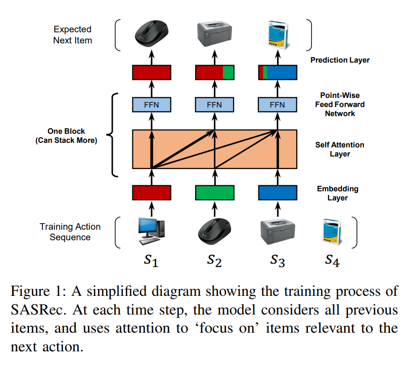
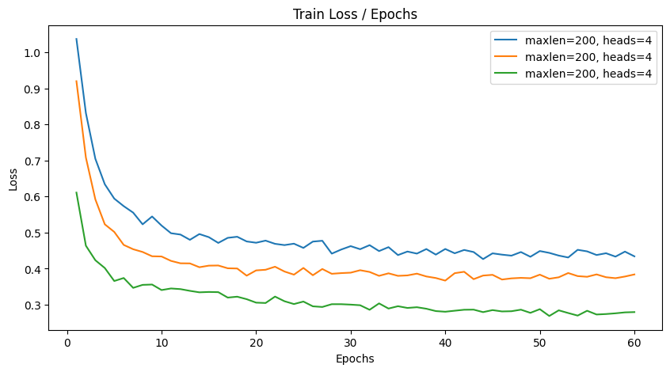
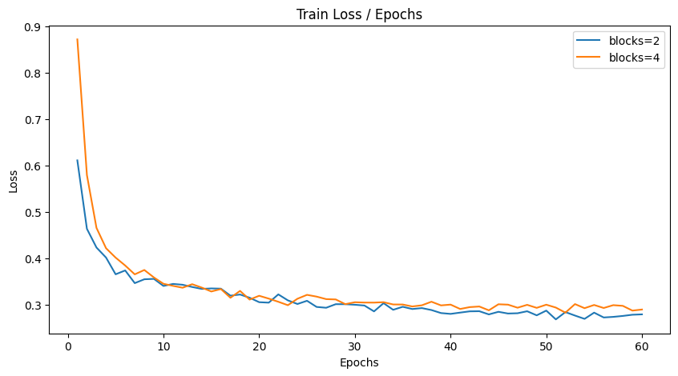
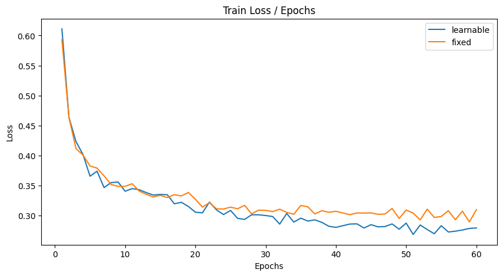

# 比赛信息
## 赛题简介
比赛地址为：[图书推荐系统 Competitions - DataFountain](https://www.datafountain.cn/competitions/542)
依据真实世界中的用户-图书交互记录，利用机器学习相关技术，建立一个精确稳定的图书推荐系统，预测用户可能会进行阅读的书籍。

## 训练集和测试集介绍

数据集来自公开数据集Goodbooks-10k，包含网站Goodreads中对10,000本书共约6,000,000条评分。为了预测用户下一个可能的交互对象，数据集已经处理为隐式交互数据集。该数据集广泛的应用于推荐系统中。

### 测试集

测试集为用户-图书交互记录，共分为两列，表头为User_id和Item_id，示例如下：

| 字段名  | 类型 | 字段解释             |
| ------- | ---- | -------------------- |
| User_id | Int  | 用户ID               |
| Item_id | Int  | 用户可能交互的物品ID |

### 训练集

测试集只有一列，为即将预测的User_id，示例：

| 字段名  | 类型 | 字段解释         |
| ------- | ---- | ---------------- |
| User_id | Int  | 需要预测的用户ID |
## 评估
采用F1值进行评价。

# 官方baseline
官方提供了一个使用矩阵分解的协同过滤方法，尝试了一下效果不佳，不过还是解读一下。

## 数据处理
在 `class Goodbooks(Dataset)` 的 `__init_dataset` 中定义了数据采样的方法。

首先读入数据集，构建self.user_book_map，存储每个用户互动过的所有书籍列表。

随后划分，对于每一个用户的交互数据，训练集使用除了最后一个item(书籍 )之外的所有item作为正样本，并按1:3添加了负样本。而验证集只使用最后一个item作为正样本，添加了99个负样本。

训练集中每个样本的结构为：(用户id，书籍id，label)。
验证集中每个样本的结构为：(用户id，已阅读书籍id，未阅读书籍id)。

## 模型定义


图片来自网上的博客[^1]。

模型的左边为一个矩阵分解层，将交互矩阵 $R^{m \times n}$ 分解为 $P^{m \times k} Q^{k \times n}$。我们可以认为 P 代表了用户偏好而 Q 代表了物品特征。模型右边为MLP，利用神经网络的记忆能力聚合交互矩阵特征。

随后将矩阵分解的结果和MLP的结果连接起来，通过一个线形层投影为一维的值，作为用户对此样本感兴趣的概率。

## 训练
训练部分计算模型输出与真实标签之间的BCELoss，验证部分计算验证集的hits。

## 评估
训练了5个epoch后提交，最终得分为0.008。


## 不足之处
官方的baseline代码有些bug，跑不通，所以最后是按参考的博客[^1]来实现的。

baseline首先框架较为简单，更严重的问题是数据处理，导致模型训练起来非常的慢。虽然实际应用中正样本会远多于负样本，但按baseline的采样方法，训练一个epoch要花近5分钟，而显卡利用率不到20%，大多数时间都在加载数据。最后预测也要花很长时间，显著超过了我随后采用的更复杂的模型。

综合考虑后，我选择放弃拓展baseline的方法，采用下文提到的SASRec。

# SASRec模型
## 介绍
SASRec[^2]是一种利用自注意力进行序列推荐的方法。

协同过滤CF的方法没有考虑用户对item的交互顺序，或者说是时间戳，所以在捕捉用户动态偏好方面存在明显的不足。序列推荐聚焦于，根据用户到t时刻的交互序列建模，来预测用户第t + 1 时刻的交互。比赛提供的数据其实没有时间戳，但比赛亚军在网上开源的技术报告[^3]中提到他们使用SASRec的效果最好。所以推测比赛数据集其实是含有序列信息的，只是没有提供时间戳。~~也可能只是注意力参数够多，大力出奇迹了~~

总而言之，学习先进经验，我也决定采用SASRec模型。论文原作者开源了他们用tensorflow实现的代码，我随后在github上找到了使用pytorch1.6实现的版本[^4]，万幸还能跑得通，赞美pytorch。我在此基础上增加了日志记录，并且调参研究了模型性能。感谢开源作者无私付出。

## 模型架构
下图为论文原文[^2]中的配图：


此图说明了注意力机制如何利用先前的序列预测下一个可能交互的物品，但是没有特别清楚的展示模型细节，所以我自己画了一个模型架构图：



随后来详细说明各个部分：

### 输入
输入为给定用户的交互序列以及待预测的物品。

交互序列的长度通过参数maxlen控制，不足的部分以0填充。经过nn.embedding层处理为嵌入向量，嵌入向量的维数通过参数hidden_units控制，随后通过注意力块提取特征。

待预测物品也处理为嵌入向量，随后在Predict层计算得分。

### 位置编码
注意力机制并不带有位置信息，需要额外添加位置编码：
$$
\hat{E} =
\begin{bmatrix}
M_{s1} + P_1 \\ M_{s2} + P_2 \\ ... \\ M_{sn} + P_n 
\end{bmatrix}
$$

论文原文采用了可学习的位置编码，而非Transformer论文中的固定位置编码。作者提到固定位置编码效果不佳，我随后做了对比试验，见实验部分。

可学习位置编码的劣势在于难以迁移，每个数据集的位置编码不一定可迁移，而且n改变后还要重新学习位置编码。不过为了刷比赛得分，最终还是采用了可学习位置编码。

### Causal Self-Attention
Self-Attention采用torch.nn.MultiheadAttention实现。此外，增加了掩码，使得预测当前物品时不能看到之后的序列信息，具有时间上的因果性。代码如下：
```Python
        tl = seqs.shape[1] # time dim len for enforce causality
        attention_mask = ~torch.tril(torch.ones((tl, tl), dtype=torch.bool, device=self.dev))
        # 一些其他代码
            mha_outputs, _ = self.attention_layers[i](Q, seqs, seqs, 
                                            attn_mask=attention_mask
                                            )
```

注意力输出的结果随后添加残差连接并经过LayerNorm。

### PointWiseFFN
FFN层有两个一维卷积、一个ReLU和两个Dropout层，作用顺序为 `self.dropout2(self.conv2(self.relu(self.dropout1(self.conv1(inputs.transpose(-1, -2))))))` 。随后增加了残差连接并过LayerNorm层。

虽然论文[^2]中一直称为FFN层，但无论是作者自己的实现[^5]还是我参考的Pytorch实现[^4]，这层都是用kernel_size=1的一维卷积而不是linear层。这本质上是一样的，不过不同的初始化方法可能会略微影响到结果，我们还是沿用[^4]的实现。

### 预测
经过N个堆叠的注意力块，用户的交互序列被处理为一个和embedding形状相同的向量。随后将待预测物品经过nn.embedding层处理为embedding向量，与序列向量做点乘，输出值为当前物品的得分，代表了用户对当前物品感兴趣的程度。

## 训练
### 采样
将每个序列的最后一个物品（理论上是最后一次交互的物品）采为正样本，随机一个不在序列中的物品采为负样本，将序列中剩余的部分作为训练序列。所以一个200维的序列采样后得到199维序列，1个正样本，1个负样本。

开源代码[^4]的实现中用了多线程采样，默认workers数为3，我沿用了这些设置。

### 优化
根据采样后的序列，计算正样本和负样本的得分，随后计算BCELoss，用Adam算法优化。

## 评估
开源代码[^4]将数据集划分为三部分。（对这个比赛来说，只是把训练数据划分为了三部分方便调试，比赛的测试集并没有给标签）。

统计每个用户的交互序列，如果长度大于3，则将最后两个物品分别作为测试和验证样本，其余部分作为训练样本。否则只有训练样本。

随后[^4]实现了evaluate方法，计算测试集和验证集的前十个预测值的NDCG和HR值。这个比赛的评价标准是F1值，不考虑顺序，所以我们选择HR值评估模型。

# 实验
## 实现细节
训练策略基本按照[^4]的策略，虽然我尝试了更多最近流行的策略，如将Adam替换为AdamW、增加冷启动等，但效果都不如原本的参数好。有效的修改是增加学习率衰减和batch_size，可以略微提升性能。最终的策略如下：
1. 优化算法采用Adam算法。
2. batch_size为512。
3. 学习率初始值为1e-3，每过10个epoch衰减一半。这有助于略微提升性能。

此外，[^4]的输入为txt格式，并且物品和用户都从1开始编号。0作为序列的填充项。而比赛的数据从1开始编号。在baseline一节我提到官方示例处理数据非常的慢，因此此处选择将比赛数据处理为txt格式，顺便调整编号从1开始。具体见 `to_txt.py` 文件。

## 输出结果
首先处理比赛给定的训练数据，将每个用户的交互序列存储在 `User` 列表中。随后准备每个用户的待预测物品列表 `user_test` ，其中存储了所有不在 `User` 中的物品。

随后为每个用户计算他与待预测物品物品交互的可能性。这部分代码基本来自开源代码[^4]中的evaluate函数。对每个用户，调用模型的predict方法为所有待预测物品评分，并取得分最高的前10项输出到.csv文件中：
```python
        # 将给定的训练数据倒序存储到交互序列seq中
        for j in reversed(User[i]):
            seq[idx] = j
            idx -= 1
            if idx == -1: break
        # 待预测的item列表，存储在之前处理好的user_test列表中
        item_idx = user_test[i]
        p = [np.array(l) for l in [[i], [seq], item_idx]]
        # 计算所有待预测item的得分，取前10个item作为推荐结果
        predictions = -model.predict(*p)
        predictions = predictions[0]
        a = predictions.argsort()[:10]
```

最后提交生成的.csv文件到比赛界面，得到评分。

这边有个需要注意的细节：模型预测的不是物品ID，而是它在user_test中的索引。因为每个用户的user_test只包含未交互过的物品，所以ID和索引并不一一对应。不注意这点的话可以交出小数点后4位的难绷分数：


## 调参分析
### maxlen与num_heads
maxlen控制每个用户采样的交互序列长度，num_heads控制注意力头数。固定每个头的特征数为50，结果如下：

| maxlen | num_heads | train_loss | HR@10_valid |
| ------ | --------- | ---------- | ----------- |
| 50     | 1         | 0.4342     | 0.8585      |
| 200    | 1         | 0.384      | 0.8682      |
| 200    | 4         | **0.2796** | **0.8717**  |




比赛数据集每个用户的平均序列长度约为107，但是设置更大的序列长度后效果有显著提升。后续都设置为200。

增加注意力head数后，loss显著下降，HR值也有略微提升。比赛亚军的报告[^3]中尝试不增加head数、只增加embedding维度，效果提升不大，因此我没有做相应的实验。总之，同时增加head数和embedding维度才能达到较好的效果，可能是因为多头注意力更容易优化。

### num_blocks
num_blocks控制注意力块(即模型架构图中的灰色块)堆叠的个数，默认为2。在maxlen=200，num_heads=4的前提下，探究更多注意力块的影响：

| num_blocks | train_loss | HR@10_valid | submission |
| ---------- | ---------- | ----------- | ---------- |
| 2          | **0.2796** | 0.8717      | **0.1430** |
| 4          | 0.29       | **0.8789**  | 0.1418     |



没有太大影响，2块的提交成绩略好一些，4块的验证集HR值略高一些。说明2块4头注意力已经足够处理比赛数据集了，继续堆叠会造成一些优化的困难。不过努力调参的话4块应该是会略好一些。

### 固定位置编码
模型架构一节提到了原论文[^2]实验固定位置编码效果不佳，我之前的实验也都采取可学习位置编码。此处做一下消融实验。

固定位置编码采取Transformer论文中的编码方式，即：
$$
\begin{align}
 PE_{p,2i} = \sin\left(\frac{p}{10000^{2i/d_{model}}}\right)  \\
PE_{p,2i+1} = \cos\left(\frac{p}{10000^{2i/d_{model}}}\right) 
\end{align}
$$
其中p为位置，i为特征的维度，$d_{model}$ 为嵌入向量维度(本次实验一般为200)。 

我增加了参数 `--fixed_position_encode` （默认为false），在maxlen=200、num_heads=4、num_blocks=2的设置下对比了固定位置编码与可学习位置编码的效果：

| 位置编码 | train_loss | HR@10_valid | submission |
| ---- | ---------- | ----------- | ---------- |
| 可学习  | **0.2796** | 0.8717      | **0.1430** |
| 固定   | 0.3101     | **0.8722**  | 0.1378     |


固定编码后loss和submission都略微变差了一些。但是HR值上升了。不过结合前面几个实验结果，可以看出HR值并不是一个好的评价标准，往往和loss以及提交分数都不相符。

# 结论
我最终选择SASRec模型，参数为:
```
batch_size,512
dataset,goodbooks
device,cuda
dropout_rate,0.2
fixed_position_encode,False
hidden_units,200
inference_only,False
l2_emb,0.0
lr,0.001
maxlen,200
num_blocks,2
num_epochs,60
num_heads,4
```

提交后得分：


超过了参考的亚军方案[^3]，以微弱优势拿到第二，大概是榜单上使用SASRec的方案中效果最好的（不知道第一用的什么方案）。不过没有什么实质性的创新，分数上升全靠调参。

# 分工说明
没有其他组员，所有工作都由我完成。

# 参考

[^1]: [基于NeuralCF的图书推荐系统 | 南极Python (hans0809.github.io)](https://hans0809.github.io/2021/11/17/%E5%9F%BA%E4%BA%8ENeuralCF%E7%9A%84%E5%9B%BE%E4%B9%A6%E6%8E%A8%E8%8D%90%E7%B3%BB%E7%BB%9F/)
[^2]: [Self-Attentive Sequential Recommendation (arxiv.org)](https://arxiv.org/abs/1808.09781)
[^3]: [CCF大数据与计算智能大赛训练赛——图书推荐系统技术报告_CSDN博客](https://blog.csdn.net/weixin_42200347/article/details/127455877)
[^4]: [PyTorch(1.6+) implementation of SASRec](https://github.com/pmixer/SASRec.pytorch/tree/master)
```
@software{Huang_SASRec_pytorch,
author = {Huang, Zan},
title = {PyTorch implementation for SASRec},
url = {https://github.com/pmixer/SASRec.pytorch},
year={2020}
}
```
[^5]: [SASRec: Self-Attentive Sequential Recommendation (github.com)](https://github.com/kang205/SASRec/tree/master)